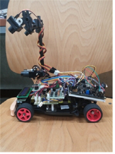

# 2015-Autonomous-Model-Car-Competition

This project was for the 2015 Intelligent Mode car Racing Contest in Hanyang University.  
  
Team ESPERS in Seoul National University of Science and Technology  
Ranked 4th/89 and awarded silver medal.  

IDE: Code Warrior 10.5  
Microcontroller: Freescale MPC5606B  

  

# Video: https://www.youtube.com/watch?v=pzmS27dW-Ac
